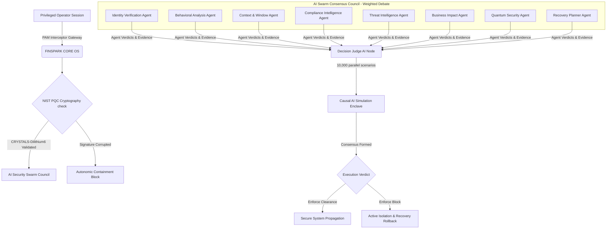

# FINSPARK CORE: Cognitive Banking Defense Operating System

[](https://opensource.org/licenses/MIT)
[](https://fastapi.tiangolo.com)
[](https://nextjs.org)
[](https://csrc.nist.gov/projects/post-quantum-cryptography)

> **FINSPARK CORE** is an Autonomous Cognitive Security Operating System designed specifically for Tier-1 financial institutions and banking ecosystems. Rather than operating as a basic fraud scanner, FINSPARK CORE runs as an **AI Security Operations Center (SOC)**, intercepts administrative sessions at the PAM (Privileged Access Management) gateway layer, and deliberates security operations through a multi-agent **AI Swarm Consensus Council**.

---

## 🏛️ System Architecture Overview



---

## 🚀 Key Technological Pillars

### 🧠 1. Cognitive Banking Brain (Layer 0)
Routes every incoming transaction, command execution, and network request through a single master intelligence core. The operating system monitors APIs, SWIFT settlements, ATMs, core banking ledgers, mobile/internet banking gateways, and employee directories.

### 👥 2. Weighted AI Swarm Consensus Council
Eight specialized micro-agents run parallel evaluations, producing unique votes, confidence metrics, and threat evidence.
- **Identity Agent**: Audits device trust markers, biometric signals, and MFA strength.
- **Behavior Agent**: Compares command syntax history and scheduling drift limits.
- **Context Agent**: Cross-references IT maintenance windows, change management tickets, and active incident response tickets.
- **Compliance Agent**: Validates Segregation of Duties (SoD), RBI rules, and EU-GDPR sovereignty guidelines.
- **Threat Agent**: Flags privilege escalation shell scripts, defense evasion cleanups, and lateral exfiltration.
- **Business Impact Agent**: Forecasts blast radius downtime, customer impact scale, and complexity bounds.
- **Quantum Security Agent**: Audits lattice-based post-quantum cryptographic signature validation.
- **Recovery Planner Agent**: Maps step-by-step containment plans and safe rollback strategies.

### 🔮 3. Causal AI Simulation Enclave
Runs **10,000 parallel futures** in isolated sandbox containers. Recalculates risk parameters dynamically using interactive sliders (e.g., transaction value limits and MFA step-up authentication check status).

### 🌌 4. Apple Vision Pro Inspired Interface
A beautiful light-themed, spatial UI designed with modern aesthetics:
- **Glassmorphism panels** (`backdrop-filter: blur(20px)`).
- **Consensus SVG neural network** showing Judge AI and outer nodes with animated particle traffic.
- **VS Code + Figma resizable columns** and an **interactive Explainability Pyramid** (Business Summary $\rightarrow$ Evidence Signals $\rightarrow$ AI Swarm Debate $\rightarrow$ Technical Logs).

---

## 🛠️ Installation & Setup

### Prerequisites
- Python 3.10+
- Node.js 18+
- Git

### 1. Clone & Initialize the Project
```bash
git clone https://github.com/prajansanjayk1/FINOAISPARK.git
cd FINOAISPARK
```

### 2. Configure Backend Engine (FastAPI)
```bash
cd backend
python -m venv .venv
source .venv/bin/activate  # On Windows use: .venv\Scripts\activate
pip install -r requirements.txt
```

Create a `.env` file inside the `backend` directory to activate live cognitive AI checks:
```env
# Credentials for Advanced Cognitive AI Analysis
GEMINI_API_KEY=your_google_gemini_api_key_here
# Optional OpenAI fallback
OPENAI_API_KEY=your_openai_api_key_here
USE_LLM=True
```

Run the backend server:
```bash
python -m uvicorn main:app --host 127.0.0.1 --port 8000
```

### 3. Launch Frontend Dashboard (Next.js)
```bash
cd ../frontend
npm install
npm run dev
```
Open [http://localhost:3000](http://localhost:3000) inside your web browser.

---

## 🔬 Running Automated Tests
The backend contains automated tests verifying API integrations, database precedence matching, and simulated policy engines.
```bash
cd backend
python test_scenarios.py
```

---

## 📄 License
This project is licensed under the MIT License - see the [LICENSE](LICENSE) file for details.
